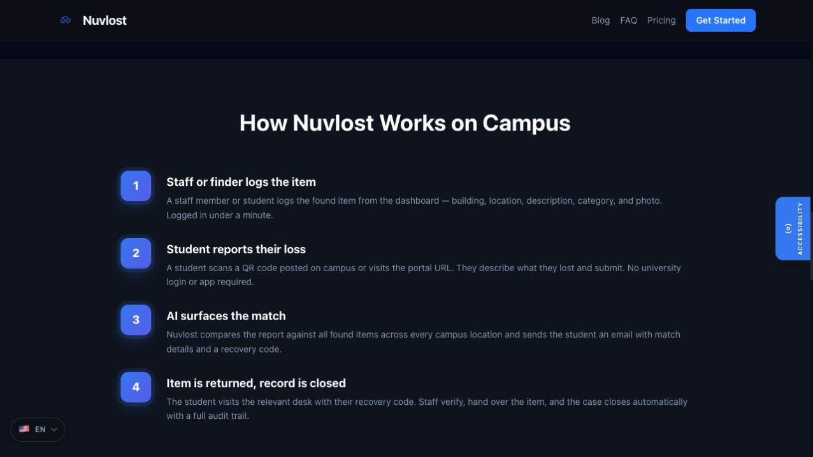
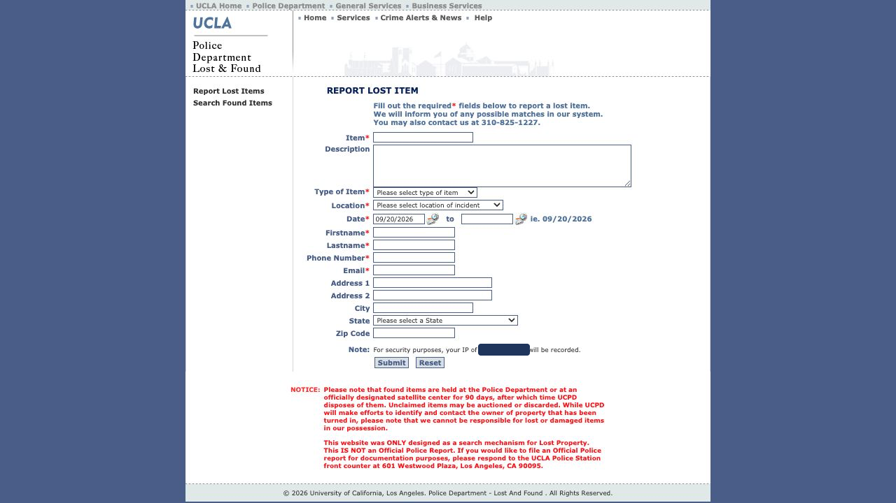

# Entrega 2 — Público-alvo e análise de concorrência

**Data:** 23/09/2026  
**Status:** 🟩 concluída  
**Responsabilidade mínima:** cada integrante analisa pelo menos 1 concorrente/interface representativa; a equipe produz síntese comparativa.

## Objetivo da atividade

Compreender soluções do mesmo domínio **e também interfaces familiares ao público-alvo**. O objetivo não é copiar telas, mas identificar convenções, padrões, affordances percebidas, problemas recorrentes, expectativas e oportunidades de design.

> **Concorrente não precisa ser idêntico ao produto.** Pode atuar na mesma área, resolver objetivo semelhante ou disputar a mesma necessidade. Quando não houver concorrente direto, use produtos análogos e softwares que o público já utiliza.

### Para TCCs que não previam interface

Não procure apenas um “concorrente do algoritmo”. Investigue **interfaces profissionais que materializam atividades semelhantes** às que o usuário escolhido precisaria realizar.

Exemplos:

- TCC de banco de dados → consoles de administração, ferramentas para DBA, monitoramento e análise de consultas;
- TCC de LLM/ML → painéis de experimentos, gestão de modelos/datasets, comparação de métricas, revisão de resultados;
- TCC de análise de dados → dashboards, ferramentas de BI, filtros, relatórios e exploração;
- TCC de infraestrutura/API → portais administrativos, observabilidade, logs, gestão de credenciais e uso;
- TCC de cibersegurança → consoles de alertas, triagem, histórico e auditoria.

A pergunta é: **“que convenções esse perfil já conhece para executar tarefas equivalentes?”**

## Entrada obrigatória da Entrega 1

Retome o mapa inicial de alternativas e produtos citado na Entrega 1. Aqui a equipe deixa de trabalhar apenas com impressão inicial e passa a **investigar sistematicamente** cada solução.

| Item citado na Entrega 1 | Tipo | Por que foi citado | Status inicial | Decisão nesta entrega |
|---|---|---|---|---|
| Nuvlost | concorrente direto | trata achados e perdidos em campus | F | analisar como C01 |
| UCLA Lost & Found | solução institucional análoga | oferece relato de perda e busca de achados | F | analisar como C02 |
| MissingX | concorrente indireto | conecta pessoas a escritórios de achados e perdidos | F | analisar como C03 |

Se uma hipótese da Entrega 1 for confirmada ou refutada durante esta análise, atualize `H01`, `H02`... em [`../RASTREABILIDADE.md`](../RASTREABILIDADE.md).

## 1. Público-alvo desta análise

O foco principal é P01, estudante que perdeu um item. Também foram observados os fluxos relacionados a P02, que encontrou o objeto, e P03, papel hipotético de mediação. A análise considera busca rápida pelo celular, registro de informações e segurança na devolução.

## 2. Concorrentes diretos/indiretos

### Análise C01 — Nuvlost

**Autor(a):** Karen Natally de Moraes — 221210867  
**Tipo:** direto  
**Link oficial:** <https://nuvlost.com/university-lost-and-found>  
**Data de acesso:** 20/09/2026

#### Contexto e proposta

[F] A Nuvlost apresenta uma solução de achados e perdidos para universidades e faculdades. O fluxo descrito no site inclui registro do item encontrado, relato da perda, comparação entre os registros, aviso de possível correspondência e devolução com código de recuperação.

*Figura 1 — Estado público do fluxo da Nuvlost. Fonte: captura do site oficial, 20/09/2026.*

#### Funcionalidades relevantes

| Funcionalidade | Como é realizada | Evidência/print | Observação de IHC |
|---|---|---|---|
| registro do achado | local, descrição, categoria e foto | `../assets/02_concorrencia/nuvlost_fluxo.png` | dados estruturados favorecem a comparação |
| relato da perda | portal acessível por URL ou QR code | `../assets/02_concorrencia/nuvlost_fluxo.png` | reduz a dependência de instalar aplicativo |
| correspondência | comparação entre relatos de perda e achado | `../assets/02_concorrencia/nuvlost_fluxo.png` | o resultado precisa explicar por que os itens podem corresponder |
| devolução | código único e fechamento do registro | `../assets/02_concorrencia/nuvlost_fluxo.png` | ajuda a verificar e documentar a entrega |

#### Experiência do usuário e opiniões

Use avaliações públicas, relatos, estudos, testes próprios ou outra fonte identificável. Não trate opinião isolada como verdade universal.

A apresentação pública organiza o processo em quatro etapas, deixando claro o começo e o fim. A solução também separa quem perdeu, quem encontrou e quem realiza a entrega. A interface operacional completa não é pública; por isso, a inspeção ficou limitada aos estados acessíveis sem cadastro.

#### Preço/modelo de negócio

[F] Serviço comercial voltado a organizações. O site apresenta uma página própria de preços.

#### Padrões e tendências percebidos

Fluxo dividido em etapas, registro por local, comparação entre relatos e verificação antes da devolução.

#### Pontos positivos, limitações e lições

| Ponto | Evidência | Implicação para nosso projeto |
|---|---|---|
| fluxo dividido em etapas | seção “How Nuvlost Works on Campus” | mostrar progresso e estado do caso |
| devolução com verificação | código de recuperação descrito no site | não expor todos os detalhes antes da confirmação |
| suporte a vários locais | registro por prédio, andar ou departamento | considerar local e ponto de retirada |
| interface operacional não aberta | inspeção do site público | não concluir detalhes de uso que não foram observados |

> Repita a subseção para C02, C03... até atender à quantidade da equipe.

### Análise C02 — UCLA Lost & Found

**Autor(a):** Karen Natally de Moraes — 221210867  
**Tipo:** análogo institucional  
**Link oficial:** <https://lostandfound.ucla.edu/>  
**Data de acesso:** 20/09/2026

#### Contexto e proposta

[F] O portal do UCLA Police Department permite relatar um item perdido e acessar uma busca de itens encontrados. O formulário solicita dados do objeto, tipo, local, período e informações de contato.

*Figura 2 — Formulário público de relato de item perdido da UCLA. O endereço IP exibido pelo portal foi ocultado por privacidade. Fonte: captura do portal oficial, 20/09/2026.*

#### Funcionalidades relevantes

| Funcionalidade | Como é realizada | Evidência/print | Observação de IHC |
|---|---|---|---|
| relato de perda | formulário em uma página | `../assets/02_concorrencia/ucla_formulario.png` | todos os campos ficam visíveis, mas o formulário é longo |
| categorização | lista de tipos de item | `../assets/02_concorrencia/ucla_formulario.png` | padroniza parte da descrição |
| localização | lista extensa de locais | `../assets/02_concorrencia/ucla_formulario.png` | ajuda a comparar registros, mas exige boa organização |
| período | data inicial e final | `../assets/02_concorrencia/ucla_formulario.png` | reconhece que a pessoa pode não saber o momento exato |

#### Experiência do usuário e opiniões

A navegação principal separa “Report Lost Items” de “Search Found Items”. A terminologia é direta e os campos obrigatórios são marcados. Como limitação, a página reúne muitos campos e listas extensas, o que pode aumentar o esforço em telas pequenas.

#### Preço/modelo de negócio

[F] Serviço institucional público da UCLA, sem preço apresentado ao usuário.

#### Padrões e tendências percebidos

Separação entre relato e busca, categorização do item, registro de período aproximado e marcação de campos obrigatórios.

#### Pontos positivos, limitações e lições

| Ponto | Evidência | Implicação para nosso projeto |
|---|---|---|
| separação entre relatar e buscar | navegação lateral | deixar as intenções principais visíveis |
| período em vez de horário exato | campos de data | aceitar incerteza sobre quando ocorreu a perda |
| muitos dados pessoais | formulário | pedir somente os dados necessários |
| formulário extenso | captura local | dividir o preenchimento em grupos ou etapas curtas |

### Análise C03 — MissingX

**Autor(a):** Karen Natally de Moraes — 221210867  
**Tipo:** indireto  
**Link oficial:** <https://www.missingx.com/>  
**Data de acesso:** 20/09/2026

#### Contexto e proposta

[F] A MissingX permite pesquisar itens encontrados publicados por escritórios de achados e perdidos. A pessoa pode reivindicar um resultado ou registrar a perda e aguardar a confirmação do escritório responsável.

*Figura 3 — Busca inicial de item perdido na MissingX. Fonte: captura do site oficial, 20/09/2026.*

#### Funcionalidades relevantes

| Funcionalidade | Como é realizada | Evidência/print | Observação de IHC |
|---|---|---|---|
| busca inicial | descrição do item em uma palavra | `../assets/02_concorrencia/missingx_busca.png` | oferece entrada rápida e baixo esforço inicial |
| consulta ampla | campo pode ficar vazio para mostrar todos os itens | `../assets/02_concorrencia/missingx_busca.png` | atende quem não sabe qual termo usar |
| reivindicação | registro de dados ao encontrar possível correspondência | guia oficial | separa descoberta de confirmação |
| espera por confirmação | escritório pode pedir mais informações | guia oficial | o estado de espera precisa ser explicado |

#### Experiência do usuário e opiniões

A busca inicial é simples e destaca uma única ação. O guia deixa claro que a plataforma faz a conexão, mas o escritório responsável confirma a correspondência e organiza a devolução. A espera pode gerar incerteza se o andamento não estiver visível.

#### Preço/modelo de negócio

[F] A empresa oferece a solução a organizações e mantém a busca pública para pessoas que perderam objetos. O preço comercial não foi identificado nas páginas analisadas.

#### Padrões e tendências percebidos

Busca inicial simples, separação entre possível correspondência e confirmação, mediação de um responsável e instruções de retirada ou envio.

#### Pontos positivos, limitações e lições

| Ponto | Evidência | Implicação para nosso projeto |
|---|---|---|
| início com uma pergunta simples | captura local | permitir uma busca rápida antes de exigir cadastro detalhado |
| separação entre busca e confirmação | guia oficial | não tratar semelhança visual como propriedade comprovada |
| mediação do escritório | guia oficial | deixar claro quem precisa agir em cada etapa |
| espera por retorno | guia oficial | informar estado, próxima ação e prazo quando conhecido |

## 3. Softwares que o público-alvo usa no cotidiano

Analise interfaces que moldam a expectativa do público, mesmo que não sejam concorrentes.

| Software | Por que o público usa | Padrões relevantes | Prints | O que aprender |
|---|---|---|---|---|
| Não identificado nesta etapa | Ainda não houve pesquisa com participantes para afirmar quais softwares são familiares | Não se aplica | Não se aplica | Não adotar referência cotidiana sem evidência |

## 3.1 Padrões de interface relevantes ao escopo de IHC

Registre somente padrões encontrados nas soluções analisadas e que possam ter relação com objetivos reais da equipe.

| Padrão observado | Produto(s) | Para qual tarefa serve | Vantagem percebida | Risco/limitação | Aplicável ao nosso escopo? |
|---|---|---|---|---|---|
| dashboard | Nuvlost e MissingX | acompanhar casos e devoluções | reúne estados e pendências | P03 ainda é hipotética | talvez |
| relatório | nenhum dos estados públicos analisados | não há tarefa de relatório identificada | não avaliada | criar sem necessidade real | não |
| histórico + filtros | UCLA e MissingX | localizar registros por categoria, local e período | reduz o conjunto de itens | listas extensas ou filtros rígidos | sim |
| administração/CRUD | Nuvlost e MissingX | registrar, atualizar e concluir casos | organiza o ciclo do registro | regras e permissões ainda desconhecidas | talvez |
| comparação de resultados | Nuvlost e MissingX | comparar perda e achado | apoia possível correspondência | semelhança não comprova propriedade | sim |

> O objetivo não é concluir “todo concorrente tem dashboard, então teremos um”. O padrão só será adotado se apoiar uma tarefa rastreável.

## 4. Síntese comparativa da equipe

| Critério | C01 | C02 | C03 | Oportunidade para o projeto |
|---|---|---|---|---|
| Navegação | fluxo por etapas | relatar ou buscar | pergunta de busca | separar busca e registro como intenções principais |
| Feedback/estado | etapas até fechamento | promessa de contato | espera por confirmação | mostrar estado e próxima ação |
| Prevenção/recuperação de erro | código de recuperação | campos obrigatórios | confirmação pelo escritório | preservar características para comprovação |
| Terminologia | voltada ao campus | direta e institucional | simples para o público | usar termos comuns e explicar cada papel |
| Acessibilidade | ferramenta na página pública | texto pequeno em interface antiga | contraste alto; avisos interrompem | validar contraste, tamanho e leitura móvel |
| Eficiência | acesso sem instalar aplicativo | formulário único e longo | busca inicial curta | priorizar uso móvel e preenchimento curto |

## 5. Recomendações derivadas

Liste recomendações com origem explícita.

- **RC01:** permitir busca rápida antes de exigir o registro completo — derivada de C02 e C03.
- **RC02:** usar categoria, local e período como dados comuns de comparação — derivada de C01 e C02.
- **RC03:** mostrar o estado do caso e a próxima ação esperada — derivada de C01 e C03.
- **RC04:** reservar características não públicas para confirmar a propriedade — derivada de C01 e C03.
- **RC05:** evitar formulário longo em uma única etapa no celular — derivada da limitação observada em C02.

## Referências

- NUVLOST. *Lost & Found for the Modern University Campus*. Disponível em: <https://nuvlost.com/university-lost-and-found>. Acesso em: 20 set. 2026.
- UCLA POLICE DEPARTMENT. *Lost and Found*. Disponível em: <https://lostandfound.ucla.edu/>. Acesso em: 20 set. 2026.
- MISSINGX. *Quick Tour of MissingX*. Disponível em: <https://www.missingx.com/en/help/quick-tour-of-missingx>. Acesso em: 20 set. 2026.

## Checklist

- [x] O mapa inicial de alternativas da Entrega 1 foi revisitado e aprofundado.
- [x] Hipóteses relevantes sobre mercado/padrões foram atualizadas na rastreabilidade quando surgiram evidências.
- [x] Há pelo menos uma análise completa por integrante.
- [x] Cada análise contém prints legíveis da interface.
- [x] Prints mostram telas/estados relevantes, não apenas logos/homepage.
- [x] Foram analisados concorrentes e/ou interfaces representativas ao público.
- [ ] Em TCC sem interface original, foram investigadas ferramentas profissionais análogas às atividades do usuário escolhido.
- [x] Padrões como dashboard, relatório, filtros e CRUD foram analisados como soluções para tarefas, não como requisitos automáticos.
- [x] Opiniões de UX têm fonte.
- [x] A síntese compara critérios comuns e produz recomendações.
- [x] Não há “copiar porque o concorrente faz”; há justificativa de adequação ao público/contexto.
