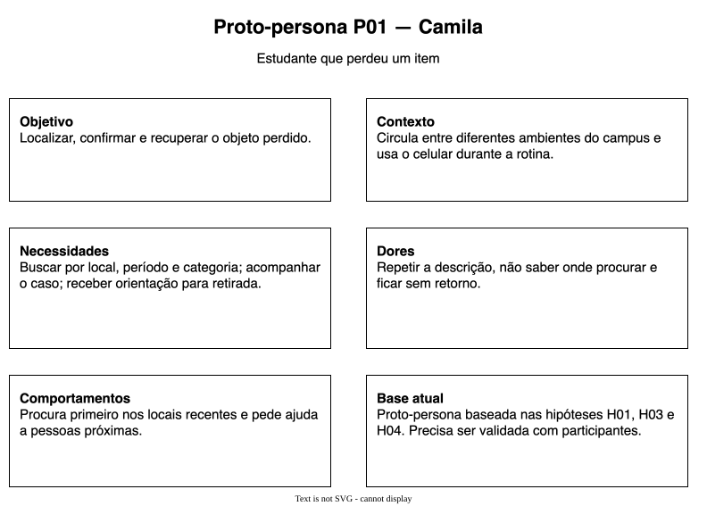
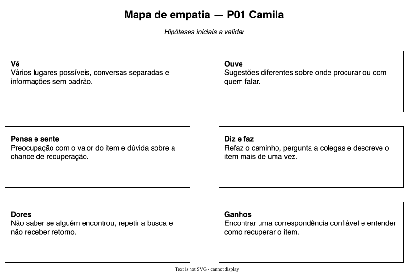

# Entrega 3 — Personas, mapa de empatia, contexto de uso e jornada

**Data:** 23/09/2026  
**Status:** 🟩 concluída  
**Responsabilidade:** 1 persona por integrante; 1 mapa de empatia, 1 contexto de uso consolidado e 1 jornada por equipe (salvo orientação diferente do docente).

## Objetivo da atividade

Representar grupos de usuários de forma útil para decisões de design. Persona não é personagem decorativo: suas características devem alterar requisitos, prioridades, linguagem, fluxos ou critérios de avaliação.

## Atenção a projetos técnicos

Em TCCs sem interface original, a persona pode representar um **profissional que se apropria da contribuição técnica**: DBA, analista, cientista de dados, administrador, pesquisador, técnico, operador, gestor ou especialista de domínio.

Não escolha um perfil apenas porque “parece combinar” com a tecnologia. Explique **qual objetivo esse perfil teria e qual parte da contribuição do TCC produziria valor para ele**. Se ainda for hipótese, mantenha como hipótese/proto-persona a validar.

Também considere papéis diferentes quando houver tarefas distintas, por exemplo:

- operador que executa análises;
- administrador que configura e gerencia permissões;
- especialista que interpreta resultados;
- gestor que consulta relatórios e decide;
- auditor que revisa histórico.

## Entradas da Entrega 1

Antes de criar personas, retome os tipos de usuários, características relevantes, objetivos e hipóteses registradas na Entrega 1. A persona **não deve transformar uma hipótese inicial em fato por meio de uma história fictícia**.

| Item da Entrega 1 | Status inicial | Evidência disponível agora | Como será tratado nesta entrega |
|---|---|---|---|
| P01 — pessoa que perdeu | H | ainda sem coleta com participantes | detalhar como proto-persona prioritária |
| P02 — pessoa que encontrou | H | ainda sem coleta com participantes | detalhar como proto-persona secundária |
| P03 — mediação do processo | H | processo institucional não confirmado | manter como papel hipotético |
| H01 — informações dispersas | H | cenário e alternativas ainda não validados | incorporar nas dores e jornada de P01 |
| H02 — encaminhamento incerto | H | cenário ainda não validado | incorporar nas dores de P02 |
| H04 — confirmação de propriedade | H | padrão observado em C01 e C03 | incorporar nas necessidades de P03 |

## 1. Personas

### Persona P01 — Camila, estudante que perdeu um item

**Autor(a):** Karen Natally de Moraes — 221210867  
**Tipo:** primária  
**Base de evidências:** proto-persona a validar  
**Hipóteses da Entrega 1 relacionadas:** H01, H03 e H04

| Campo | Descrição |
|---|---|
| Faixa etária / contexto relevante | estudante que circula entre diferentes ambientes do campus |
| Ocupação/papel | estudante que perdeu um item |
| Conhecimento do domínio | sabe descrever o próprio objeto, mas pode não lembrar o momento exato da perda |
| Experiência tecnológica | usa o celular durante a rotina e espera respostas claras |
| Objetivos | localizar o item, saber se existe possível correspondência e recuperá-lo |
| Necessidades | busca por local, período e categoria; acompanhamento do caso; orientação para retirada |
| Dores/frustrações | repetir a mesma descrição, não saber onde procurar e ficar sem retorno |
| Motivadores | recuperar um item de valor pessoal, acadêmico ou financeiro |
| Restrições/acessibilidade | pressa, lembrança incompleta, conexão variável; acessibilidade ainda não investigada |
| Ambiente típico de uso | em deslocamento, em sala ou fora do campus depois de perceber a perda |
| Comportamentos relevantes | procura primeiro nos locais recentes e pede ajuda a pessoas próximas |

**Decisões de design influenciadas por P01:**

- permitir busca rápida antes de exigir todos os dados;
- aceitar período aproximado e mais de um local possível;
- mostrar o estado do caso e a próxima ação;
- separar dados públicos de dados usados para comprovar propriedade.

> Repita para P02, P03... Cada integrante deve produzir ao menos uma persona.

### Persona P02 — Lucas, estudante que encontrou um item

**Autor(a):** Karen Natally de Moraes — 221210867  
**Tipo:** secundária  
**Base de evidências:** proto-persona a validar  
**Hipóteses da Entrega 1 relacionadas:** H02 e H03

| Campo | Descrição |
|---|---|
| Faixa etária / contexto relevante | estudante em deslocamento entre atividades |
| Ocupação/papel | estudante que encontrou um item |
| Conhecimento do domínio | conhece o local e o momento do achado, mas não sabe quais detalhes são úteis |
| Experiência tecnológica | consegue registrar informações e foto pelo celular |
| Objetivos | encaminhar o item rapidamente e aumentar a chance de devolução |
| Necessidades | instrução curta, confirmação do registro e indicação clara do próximo passo |
| Dores/frustrações | não saber para onde levar, perder tempo ou ficar responsável pelo objeto |
| Motivadores | ajudar o dono sem assumir uma obrigação longa |
| Restrições/acessibilidade | pouco tempo, mobilidade e receio de divulgar informação sensível; acessibilidade ainda não investigada |
| Ambiente típico de uso | corredor, sala, biblioteca, área comum ou deslocamento |
| Comportamentos relevantes | pergunta a pessoas próximas antes de procurar outro canal |

**Decisões de design influenciadas por P02:**

- reduzir os campos obrigatórios do primeiro registro;
- explicar quais informações e fotos não devem ser publicadas;
- permitir encaminhamento mesmo sem relato correspondente;
- confirmar quando a responsabilidade pelo item foi transferida.

### Persona P03 — Marina, pessoa que apoia a devolução

**Autor(a):** Karen Natally de Moraes — 221210867  
**Tipo:** secundária  
**Base de evidências:** proto-persona a validar  
**Hipóteses da Entrega 1 relacionadas:** H03, H04 e Q01

P03 é um papel hipotético de atendimento ou mediação. Não representa um setor confirmado da FEI.

| Campo | Descrição |
|---|---|
| Faixa etária / contexto relevante | pessoa que recebe informações ou participa da verificação |
| Ocupação/papel | apoio hipotético ao recebimento e à devolução |
| Conhecimento do domínio | precisa entender relatos e aplicar critérios consistentes |
| Experiência tecnológica | usa celular ou computador para consultar e atualizar registros |
| Objetivos | comparar casos, pedir informações adicionais e evitar devolução incorreta |
| Necessidades | histórico, estado do item, dados de contato protegidos e registro da entrega |
| Dores/frustrações | relatos incompletos, descrições contraditórias e responsabilidade pouco clara |
| Motivadores | concluir o caso com segurança e reduzir retrabalho |
| Restrições/acessibilidade | volume desconhecido, necessidade de privacidade e regras ainda não definidas; acessibilidade ainda não investigada |
| Ambiente típico de uso | ponto de atendimento ainda não confirmado |
| Comportamentos relevantes | compara características não públicas antes de autorizar a devolução |

**Decisões de design influenciadas por P03:**

- manter trilha básica de alterações e entrega;
- permitir solicitar complemento de informações;
- diferenciar possível correspondência de correspondência confirmada;
- não definir permissões ou regras institucionais antes de confirmar o processo real.

### Síntese das personas

Explique diferenças entre os perfis e qual persona é prioritária. Evite personas duplicadas que só mudam nome/foto.

P01 quer recuperar o item e precisa de visibilidade. P02 quer encaminhar o achado com pouco esforço. P03 precisa verificar e documentar a devolução. As diferenças são de objetivo e responsabilidade, não apenas demográficas. P01 é prioritária porque o resultado principal do recorte é a recuperação do objeto perdido.

## 2. Mapa de empatia — equipe

**Persona escolhida:** P01 — Camila  
**Justificativa:** é o perfil diretamente afetado pela incerteza, pela busca repetida e pela falta de retorno.

Documente também em texto: o que vê; ouve; diz/faz; pensa/sente; dores; ganhos. Diferencie **evidência** de **hipótese**.

| Dimensão | Hipóteses iniciais |
|---|---|
| vê | vários lugares possíveis, conversas separadas e informações sem padrão |
| ouve | sugestões diferentes sobre onde procurar ou com quem falar |
| diz e faz | refaz o caminho, pergunta a colegas e descreve o item mais de uma vez |
| pensa e sente | preocupação com o valor do item e dúvida sobre a chance de recuperação |
| dores | não saber se alguém encontrou, repetir a busca e não receber retorno |
| ganhos | encontrar uma correspondência confiável e entender como recuperar o item |

O mapa não representa dados coletados. Ele organiza hipóteses para pesquisa posterior.

## 3. Contexto de uso — consolidação

| Dimensão | Descrição | Implicação de design |
|---|---|---|
| Usuários | P01, P02 e P03 com objetivos diferentes | deixar ação e responsabilidade claras para cada papel |
| Tarefas | relatar perda, registrar achado, comparar, confirmar e devolver | manter continuidade entre os registros |
| Equipamentos | principalmente celular; computador possível para P03 | priorizar leitura e preenchimento móvel |
| Ambiente físico | circulação pelo campus e possível uso depois da saída | permitir uso em movimento e acesso remoto |
| Ambiente social/organizacional | colegas e outros contatos podem participar da busca | evitar exposição desnecessária de dados |
| Papéis/permissões/governança | responsável e procedimento oficial ainda desconhecidos | não fixar setor, permissão ou regra como fato |
| Volume de dados/histórico | volume desconhecido, mas casos precisam de estado e fechamento | prever busca e histórico sem assumir grande escala |

## 4. Jornada do usuário — equipe

**Persona:** P01 — Camila  
**Objetivo da jornada:** recuperar um item perdido  
**Início e fim da jornada:** da percepção da perda até a devolução ou o encerramento da busca

| Etapa | Situação/ação | Objetivo | Pensamento/emoção | Dor | Oportunidade de design | Evidência |
|---|---|---|---|---|---|---|
| 1. perceber | nota que o item não está com ela | entender quando pode ter perdido | surpresa e preocupação | lembrança incompleta | apoiar reconstrução por período e locais | H01 |
| 2. procurar | refaz o caminho e pergunta a pessoas próximas | encontrar rapidamente | urgência | esforço repetido | reunir os dados da busca em um registro | H01 |
| 3. registrar | descreve o objeto e o contexto | ampliar a busca | esperança, mas dúvida | não saber quais detalhes informar | orientar categoria, local, período e características | H03 |
| 4. comparar | recebe ou encontra possível correspondência | saber se o item pode ser o seu | expectativa e cautela | informações podem ser insuficientes | explicar semelhanças e pedir complemento | H03 e H04 |
| 5. confirmar | responde perguntas sobre características não públicas | comprovar propriedade | receio de falhar na verificação | critérios desconhecidos | preservar dados de confirmação | H04 |
| 6. recuperar | combina retirada e recebe o objeto | concluir o caso | alívio | deslocamento e instrução pouco clara | mostrar local, horário e confirmação de entrega | H04 |

> A jornada pode incluir etapas **antes, durante e depois** do uso do produto. Não transforme a jornada em lista de telas.

## Síntese

Quais necessidades e objetivos devem obrigatoriamente aparecer nos cenários e nas tarefas seguintes?

- P01 como foco da recuperação;
- registro rápido e orientado para P02;
- P03 como hipótese, sem transformar o papel em setor oficial;
- local, período, categoria e características como base de comparação;
- distinção entre possível correspondência e propriedade confirmada;
- estado, próxima ação e encerramento do caso.

## Checklist

- [x] Existe pelo menos uma persona por integrante.
- [x] As personas não são apenas diferenças demográficas superficiais.
- [x] Está claro o que é dado real e o que é hipótese/proto-persona.
- [x] A persona não “validou por ficção” uma hipótese da Entrega 1; afirmações continuam marcadas como hipótese quando não há evidência.
- [x] Objetivos e dores têm consequência para o design.
- [x] Contexto de uso está coerente com a Entrega 1.
- [ ] Em TCC sem interface original, a persona possui relação explícita com a contribuição técnica.
- [x] Papéis administrativos, técnicos e decisórios só foram criados quando possuem objetivos/tarefas diferentes.
- [x] Jornada possui etapas, dores e oportunidades e não é apenas wireflow.
- [x] IDs das personas foram adicionados à rastreabilidade.
