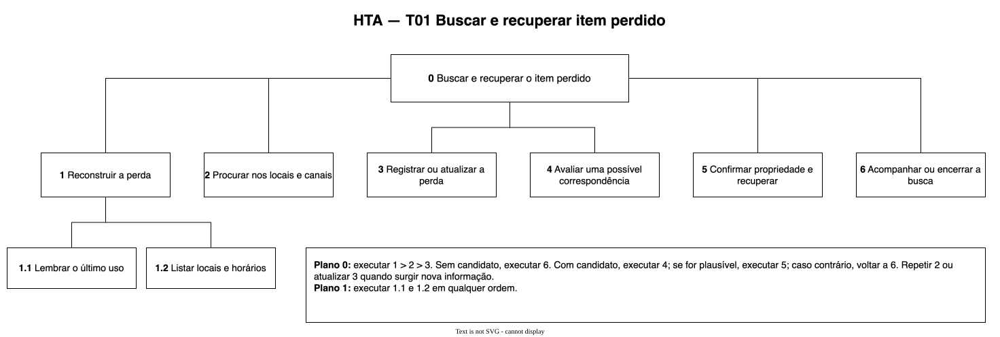
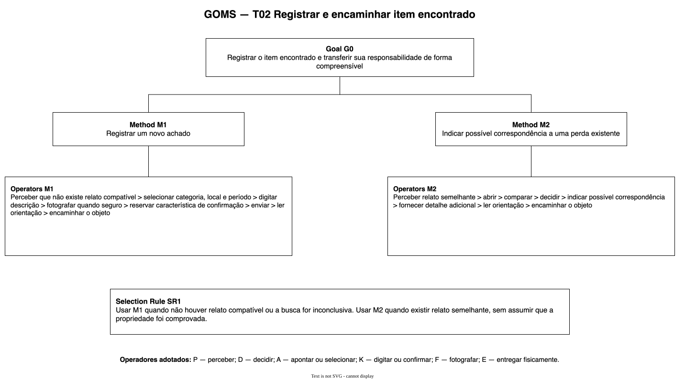
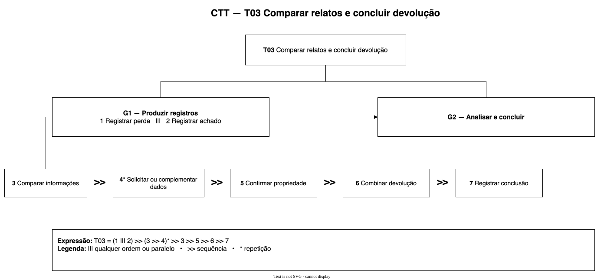

# Entrega 5 — Análise de tarefas: HTA, GOMS e CTT

**Data:** 23/09/2026  
**Status:** 🟩 concluída  
**Responsabilidade:** cada integrante modela pelo menos 1 HTA, 1 GOMS e 1 CTT. As três técnicas podem abordar a mesma funcionalidade ou funcionalidades distintas, conforme a orientação da disciplina.

## Objetivo da atividade

Modelar tarefas importantes sob perspectivas complementares: decomposição hierárquica (HTA), estrutura de metas/métodos/operações (GOMS) e relações temporais entre tarefas (CTT). O diagrama deve ser acompanhado de interpretação textual.

## Para projetos cujo TCC não previa interface

Modele **tarefas humanas relacionadas ao uso da contribuição técnica**, e não a implementação interna do algoritmo. Exemplos de boas tarefas para análise:

- investigar uma consulta de baixo desempenho;
- configurar uma análise e selecionar parâmetros;
- submeter um dataset e verificar sua validade;
- acompanhar uma execução demorada;
- comparar dois resultados/modelos;
- interpretar uma recomendação e decidir se a aceita;
- localizar uma execução anterior usando busca/filtros;
- gerar e compartilhar um relatório;
- administrar papéis/permissões quando isso for parte do trabalho real;
- revisar um alerta e registrar uma decisão.

Um CRUD pode gerar tarefas relevantes, mas “cadastrar usuário” só merece modelagem se tiver significado no domínio (papéis, validações, riscos, permissões, dependências).

## Seleção das tarefas

| ID | Tarefa | Persona/cenário de origem | Frequência/criticidade | Autor responsável |
|---|---|---|---|---|
| T01 | buscar e recuperar item perdido | P01 / C01 | crítica para o objetivo principal | Karen Natally de Moraes — 221210867 |
| T02 | registrar e encaminhar item encontrado | P02 / C01 | informação pode se perder com o tempo | Karen Natally de Moraes — 221210867 |
| T03 | comparar relatos e concluir devolução | P01, P02 e P03 / C01 | crítica para evitar entrega incorreta | Karen Natally de Moraes — 221210867 |

> Priorize tarefas necessárias para que o usuário alcance objetivos centrais. Não desperdice a modelagem em ações triviais isoladas, como “clicar em login”, se o objetivo relevante é maior. Da mesma forma, não modele o funcionamento interno do algoritmo como se fosse uma tarefa humana.

---

## HTA — T01 buscar e recuperar item perdido

**Autor(a):** Karen Natally de Moraes — 221210867

### Descrição da tarefa

A tarefa começa quando P01 percebe que o item não está com ela. Termina quando o objeto é recuperado ou quando a busca é encerrada conscientemente. O HTA mostra as subtarefas necessárias e os pontos de repetição ou decisão.

### Diagrama

### Decomposição e planos

| ID | Objetivo/operação | Plano/ordem | Problema ou decisão de design observada |
|---|---|---|---|
| 0 | buscar e recuperar o item perdido | executar 1 > 2 > 3; sem candidato, executar 6; com candidato, executar 4; se plausível, executar 5; senão, voltar a 6 | a pessoa precisa entender o estado da busca |
| 1 | reconstruir a perda | executar 1.1 e 1.2 em qualquer ordem | memória de local e horário pode ser incompleta |
| 1.1 | lembrar o último uso do item | reconstruir o momento mais recente em que ele estava presente | a lembrança pode ser imprecisa |
| 1.2 | listar locais e horários | ordenar os lugares mais prováveis | mais de um local pode ser relevante |
| 2 | procurar nos locais e canais conhecidos | consultar primeiro os locais recentes; repetir quando surgir nova informação | busca pode ficar dispersa |
| 3 | registrar ou atualizar a perda | informar dados disponíveis e confirmar o registro | formulário longo pode causar abandono |
| 4 | avaliar uma possível correspondência | comparar categoria, local, período e detalhes visíveis | semelhança não comprova propriedade |
| 5 | confirmar propriedade e recuperar | fornecer detalhe reservado > receber instrução > retirar > confirmar recebimento | instruções e responsabilidade precisam ser claras |
| 6 | acompanhar ou encerrar a busca | aguardar atualização; revisar com nova informação; encerrar quando decidido | ausência de retorno gera incerteza |

**Plano 0:** executar 1 > 2 > 3. Se não houver candidato, executar 6. Durante o acompanhamento, repetir 2 ou atualizar 3 quando surgir nova informação. Quando houver candidato, executar 4. Se ele for plausível, executar 5; caso contrário, voltar a 6.

**Interpretação:** a principal dificuldade não é apenas registrar a perda. P01 precisa reconstruir uma situação incerta, repetir partes da busca e distinguir “possível correspondência” de “item confirmado”.

**Verificação do HTA:**

- O objetivo 0 representa uma meta do usuário?
- As subtarefas são necessárias e suficientes?
- Os **planos** indicam ordem, alternativa, repetição ou condição?
- A decomposição parou em nível útil para projeto de interação?

---

## GOMS — T02 registrar e encaminhar item encontrado

**Autor(a):** Karen Natally de Moraes — 221210867

### Goal

`G0: registrar o item encontrado e transferir sua responsabilidade de forma compreensível`

### Diagrama

### Métodos, operadores e regras de seleção

- **Method M1:** registrar um novo achado.
  - Operators: perceber que não existe relato compatível; selecionar categoria, local e período; digitar descrição; fotografar quando seguro; reservar característica de confirmação; enviar; ler a orientação; encaminhar o objeto.
- **Method M2:** indicar possível correspondência a uma perda existente.
  - Operators: perceber relato semelhante; abrir; comparar; decidir; indicar possível correspondência; fornecer detalhe adicional; ler a orientação; encaminhar o objeto.
- **Selection Rule SR1:** usar M1 quando não houver relato compatível ou a busca for inconclusiva; usar M2 quando existir relato semelhante, sem assumir que a propriedade foi comprovada.

**Operadores adotados:** P — perceber; D — decidir; A — apontar ou selecionar; K — digitar ou confirmar; F — fotografar; E — entregar fisicamente.

**Contingência:** se a orientação de encaminhamento não estiver disponível, manter o registro pendente e informar que P02 ainda está com o objeto.

> Não chame qualquer passo de “método”. Em GOMS, métodos são sequências alternativas capazes de atingir uma meta; regras de seleção explicam quando escolher entre eles.

---

## CTT — T03 comparar relatos e concluir devolução

**Autor(a):** Karen Natally de Moraes — 221210867

### Descrição

O CTT representa a coordenação entre o registro da perda, o registro do achado, a comparação das informações, o pedido de complemento e a devolução. P03 continua sendo um papel hipotético.

### Diagrama

### Legenda e relações temporais usadas

| Operador/relação | Significado no diagrama | Exemplo no modelo |
|---|---|---|
| &#124;&#124;&#124; | tarefas podem acontecer em qualquer ordem ou em paralelo | P01 registra a perda e P02 registra o achado |
| >> | a tarefa à direita começa após a conclusão da anterior | comparação precede a confirmação |
| * | repetição | solicitar e receber novos detalhes até decidir |

**Tipos de tarefa:** registrar perda e registrar achado são tarefas de interação; comparar informações é tarefa de usuário de P03; solicitar confirmação e combinar a devolução são tarefas de interação entre os papéis.

**Expressão resumida:** `T03 = (1 ||| 2) >> (3 >> 4)* >> 3 >> 5 >> 6 >> 7`.

Identifique, quando aplicável, tarefas de usuário, sistema, interação e tarefas abstratas. Verifique se concorrência, escolha, habilitação, desabilitação e repetição estão representadas corretamente segundo a notação adotada em aula.

---

## Síntese da equipe

Quais problemas de interação, oportunidades e requisitos apareceram a partir das modelagens? Quais tarefas irão para o protótipo e para o teste de usabilidade?

As modelagens indicam que o registro precisa aceitar incerteza de local e período; busca, registro e acompanhamento fazem parte da mesma tarefa de P01; P02 precisa de um caminho curto e confirmação de transferência de responsabilidade; uma possível correspondência não pode ser tratada como comprovação; detalhes reservados ajudam a confirmar propriedade; e P03 precisa visualizar histórico, pendências e próxima ação. T01, T02 e T03 devem alimentar o protótipo e os testes posteriores.

## Checklist

- [x] Cada integrante produziu ao menos 1 HTA, 1 GOMS e 1 CTT.
- [x] Cada artefato identifica autor e tarefa.
- [x] Diagramas são legíveis e possuem fonte editável quando possível.
- [x] HTA contém planos, não apenas árvore de tópicos.
- [x] GOMS distingue Goals, Operators, Methods e Selection Rules.
- [x] CTT usa operadores temporais e tipos de tarefa coerentes.
- [x] Há texto explicando cada diagrama.
- [x] Tarefas estão ligadas a cenários/personas na rastreabilidade.
- [ ] Em TCC técnico, as tarefas descrevem o que a pessoa faz com a contribuição/resultados, não passos internos do código.
- [x] CRUDs, relatórios, filtros e atividades administrativas foram escolhidos por relevância ao objetivo do usuário.
